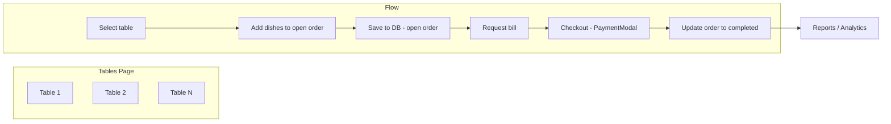

# Table-Based Ordering (Tables / Service) Feature

## What you want

- **Punch in orders and assign a table** – Create an order for a table and add dishes; the order is saved so it can be retrieved later.
- **Multiple tables, multiple orders** – Several tables can have active (open) orders at once.
- **Bill on request** – When the customer wants the bill, staff pull up that table’s order, proceed to checkout (payment method, confirm), and once paid the order appears in **analytics** (existing reports).

So the feature is: **open orders per table**, then **checkout when the customer asks for the bill**; after payment the order is **completed** and already lands in analytics because reports filter by `status = 'completed'`.

---

## Should you create a new page?

**Yes.** A dedicated **Tables** (or “Service”) page is the right place:

- **POS** stays for quick, one-off orders (no table; add to cart → pay immediately).
- **Tables** is for table service: choose table → add/save items to that table’s order → later “Request bill” → checkout → pay.

So: **new page** (e.g. `/tables`) plus **one new migration** and **extended order API**.

---

## Current state (relevant parts)

- **Orders** (`[supabase/migrations/005_orders.sql](supabase/migrations/005_orders.sql)`): `orders` has `order_number`, `total`, `payment_method`, `status` (`'completed' | 'cancelled'`), no `table_number`. Orders are created only at payment time from POS (`[src/components/Cart.tsx](src/components/Cart.tsx)` → `insertOrder` with `status: 'completed'`).
- **Reports** (`[src/app/(app)/reports/page.tsx](src/app/(app)`/reports/page.tsx)): Use `fetchOrdersWithItems` with `.eq('status', 'completed')`, so only completed (paid) orders appear in analytics.
- **Realtime**: `[useOrdersRealtime](src/hooks/useOrdersRealtime.ts)` subscribes to `orders`; new/updated orders will refresh the Tables UI.

---

## Architecture (high level)

- **Open order**: one row in `orders` with `status = 'open'`, `table_number` set, `payment_method` NULL, `total` = sum of items; `order_items` rows linked to that `order_id`.
- **Checkout**: load open order → show total → PaymentModal → on confirm, **update** that order to `status = 'completed'`, set `payment_method` and `total` (no new insert). Same order then appears in reports.

---

## 1. Database changes (new migration)

**File:** `supabase/migrations/007_table_orders.sql`

- `**orders` table**
  - Add `table_number TEXT` (nullable for backward compatibility with existing POS orders).
  - Add `'open'` to status: `CHECK (status IN ('open', 'completed', 'cancelled'))`, default remains `'completed'` for existing behavior.
  - Allow **open** orders without payment method: make `payment_method` nullable, or keep NOT NULL and set a sentinel (e.g. `'pending'`) only for `status = 'open'`. Prefer **nullable `payment_method`** when `status = 'open'` for clarity.
- **Backward compatibility**: Existing rows stay `status = 'completed'`, `payment_method` NOT NULL. New open orders: `status = 'open'`, `table_number` set, `payment_method` NULL, `total` = sum of current items.

Concretely:

- `ALTER TABLE orders ADD COLUMN table_number TEXT;`
- `ALTER TABLE orders DROP CONSTRAINT ...` (existing status check), then re-add to include `'open'`.
- `ALTER TABLE orders ALTER COLUMN payment_method DROP NOT NULL;` (and ensure CHECK allows NULL when status is open, or keep CHECK as-is if it only restricts non-null values to 'cash'/'bank').

---

## 2. Order API (`[src/lib/orders.ts](src/lib/orders.ts)`)

- `**createOpenOrder(tableNumber: string, items: CartItem[])`**  
Insert `orders` with `status: 'open'`, `table_number`, `total` (from items), `payment_method: null`, `order_number` from `getNextOrderNumber()`. Insert corresponding `order_items`. Return `orderId`.
- `**fetchOpenOrders()`**  
Return orders with `status = 'open'`, optionally with `order_items`, for the Tables page (e.g. by `table_number`).
- `**fetchOpenOrderByTable(tableNumber: string)`**  
Return a single open order (with items) for that table, or null.
- `**addItemsToOpenOrder(orderId: string, items: { product_id, product_name, qty, price_at_sale }[])**`  
Append rows to `order_items` for that `order_id`; optionally recalc and update `orders.total` for the open order.
- `**completeOrder(orderId: string, paymentMethod: PaymentMethod, total: number)**`  
Update the order: `status = 'completed'`, `payment_method = paymentMethod`, `total = total`. No new row; this order then appears in reports.
- **Order number:** Keep using `getNextOrderNumber()` when **creating** an open order so each open order has a unique display number. When completing, do not create a new order; only update. So analytics still see one order per table session.

Adjust `**getNextOrderNumber()`** to take the max of `order_number` over **all** orders (open + completed) so the next open order gets the next number. (Currently it already reads from `orders`; once open orders are in the same table, this is correct.)

---

## 3. New page: Tables

**Route:** `src/app/(app)/tables/page.tsx`

- **List view (e.g. grid of tables):**  
Tables 1–N (N configurable, e.g. 1–10 or from settings). For each table show: table label, and if there is an open order: order #, item count, current total; otherwise “No order” / “Add order”.
- **Select table → “Add order” or “Edit order”:**  
  - If no open order: call `createOpenOrder(tableNumber, [])` (or with initial items if user already selected some), then open “order detail” view.  
  - If open order exists: open “order detail” view for that order (load from `fetchOpenOrderByTable`).
- **Order detail view (for one table’s open order):**  
  - Show order # and table.  
  - Menu grid (reuse or mirror `[MenuGrid](src/components/MenuGrid)` behavior) to add dishes; on “Add” append to the open order via `addItemsToOpenOrder`.  
  - List current items (from `order_items`), with optional quantity edit/remove (implement by re-syncing order_items for that order or add update/delete helpers).  
  - **“Request bill”** button: load order total, open checkout (read-only summary + PaymentModal).  
  - On PaymentModal confirm: call `completeOrder(orderId, method, total)`; then refresh Tables list (and today stats if you show them). No cart store needed for this flow; all state is the open order in DB.
- **Realtime:** Use existing `useOrdersRealtime` (or a small variant) so that when an order is created/updated/completed, the Tables list and detail views refresh.

---

## 4. Navigation and dependencies

- **Sidebar / MobileNav:** Add a “Tables” (or “โต๊ะ” / “Service”) link to `/tables` (e.g. icon: `UtensilsCrossed` or `LayoutGrid`).  
- **No new npm dependencies**; use existing Supabase client, Zustand if needed for local UI state, and existing UI components (Button, Dialog, etc.).

---

## 5. Constraints and bugs to fix

- **DB:**  
  - Ensure migration is reversible or at least safe: existing `orders` rows keep `payment_method` and `status`; new open orders use nullable `payment_method` and `status = 'open'`.  
  - If your CHECK on `payment_method` forbids NULL, relax it (e.g. allow NULL, or allow `'pending'` only when `status = 'open'` and treat it as “unpaid” in UI).
- **Order number:**  
  - `getNextOrderNumber()` currently uses `orders`; after adding open orders to the same table, the next number will correctly include them. No change needed unless you want to reserve numbers only at completion (then you’d need a separate sequence; not recommended).
- **Reports / analytics:**  
  - Already filter `status = 'completed'`; completed table orders will appear automatically. No change.
- **POS:**  
  - Leave as-is: no `table_number`, create order with `status: 'completed'` on payment. Optional: set `table_number` to NULL for POS-created orders (already nullable).
- **Types:**  
  - In `[src/types/pos.ts](src/types/pos.ts)` or orders types, add an order type that includes `table_number` and `status: 'open' | 'completed' | 'cancelled'`.  
  - Update `[OrderWithItems](src/lib/orders.ts)` (or a new type) to include `table_number` and `status` so the Tables page and reports can use them.

---

## 6. QA checklist (after implementation)

- **Tables page:**  
  - Create open order for Table 1, add items, see order and total update.  
  - Create open order for Table 2; Table 1 still shows its order.  
  - Request bill for Table 1 → checkout → pay cash → order disappears from “open” list and appears in Reports with correct total and payment method.  
  - Table 2’s open order unchanged; pay Table 2 → same behavior.
- **Reports / analytics:**  
  - Only completed orders (POS + table checkouts) appear; revenue and order count include table orders paid by cash.
- **POS:**  
  - Unchanged: add to cart → pay → order created as completed; no table.
- **Realtime:**  
  - If two devices open Tables, completing an order on one updates the list on the other (if you hook Tables page to realtime).
- **Dependencies and build:**  
  - `npm run build` passes; no new dependency warnings.  
  - Fix any TypeScript or lint errors in new/changed files.

---

## Summary

| Area                 | Action                                                                                                            |
| -------------------- | ----------------------------------------------------------------------------------------------------------------- |
| **Feature**          | Table-based ordering: open orders per table → request bill → checkout → order completes and lands in analytics.   |
| **New page**         | Yes: **Tables** at `/tables` (list tables, open order detail, add items, request bill, PaymentModal).             |
| **DB**               | New migration: `table_number`, `status` includes `'open'`, `payment_method` nullable for open orders.             |
| **API**              | `createOpenOrder`, `fetchOpenOrders`, `fetchOpenOrderByTable`, `addItemsToOpenOrder`, `completeOrder`.            |
| **Nav**              | Add Tables link to Sidebar and MobileNav.                                                                         |
| **Bugs/constraints** | Relax `payment_method` and `status` in DB; keep reports and POS behavior; ensure order numbers and types updated. |
| **QA**               | Multi-table open orders, checkout one by one, verify in reports; POS and build/lint.                              |

